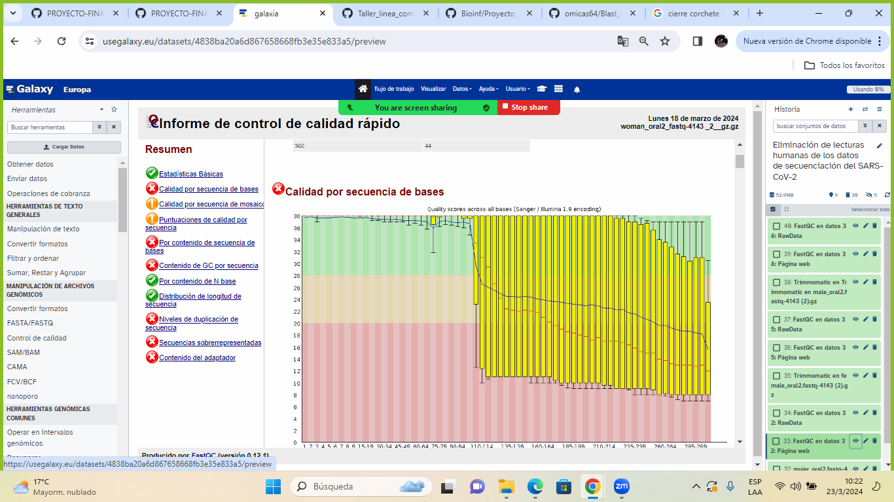
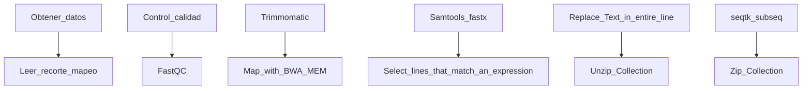
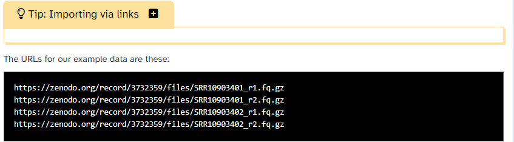

# TEMA:Eliminación de lecturas humanas de los datos de secuenciación del SARS-CoV-2

### Problema

Las muestras de pacientes para la detección de patógenos suelen estar “contaminadas” con ADN del huésped humano. Dicha contaminación, si no se elimina de los datos de secuenciación, puede plantear un problema con ciertos tipos de análisis de datos. Otro problema es que enviar las lecturas secuenciadas sin procesar con la "contaminación" de la secuencia humana incluida a una base de datos pública puede simplemente violar las regulaciones nacionales o institucionales para el manejo de datos de pacientes. Por esta segunda razón en particular, los investigadores tendrán que eliminar regularmente rastros de datos de secuenciación humana incluso de muestras que, por su naturaleza, deberían estar altamente enriquecidas solo para lecturas de patógenos, como es el caso, por ejemplo, de las muestras virales amplicónicas, en qué secuencias virales se han amplificado por PCR con cebadores específicos de virus antes de la secuenciación.(Hiltemann, Saskia, Rasche, Helena et al. 2023).

La secuenciación genómica de los virus es un proceso relativamente nuevo y complejo que requiere de una gran inversión que va desde equipos de alto costo, recursos humanos capacitados, reactivos y otros insumos, y no todos los países del mundo y de la región tienen esa capacidad instalada en sus laboratorios de salud pública para hacerla”

Usaremos datos de secuenciación de muestras de líquido de lavado broncoalveolar (BALF) obtenidas de los primeros pacientes con COVID-19 en China como nuestros datos de entrada. Dado que se espera que dichas muestras estén significativamente contaminadas con lecturas secuenciadas humanas, el efecto de los pasos de limpieza será mucho más evidente que para los datos de secuenciación amplicónica de hisopos de pacientes para diagnóstico. Sin embargo, los procesos de limpieza no dependen de ningún método de preprocesamiento o aislamiento de muestra en particular y podrían usarse sin modificaciones, por ejemplo, en muestras de SARS-CoV-2 amplificadas por ARTIC.(Batut et al., 2018)

La pandemia evoluciona de una manera muy rápida a la vez que el conocimiento que se tiene sobre este virus. A comienzos de 2020 era completamente desconocido, pero la comunidad científica ha logrado aislarlo, secuenciarlo, identificarlo y desarrollar pruebas para su diagnóstico. Como ocurre con una nueva epidemia, hay incógnitas que se irán resolviendo a medida que la epidemia evolucione y que los científicos logren entender mejor el virus. (Wu F, Zhao S, Yu B, et al.2020)

### Antecedentes

Los coronavirus son una familia de virus que normalmente afectan solo a animales. Algunos de ellos también tienen la capacidad de transmitirse de los animales a las personas lo que causa problemas respiratorios que mayoritariamente producen sintomatología leve. (Zhu N, Zhang D, Wang W, et al.2019)

El coronavirus SARS-CoV-2 es un nuevo tipo de coronavirus que puede afectar a las personas y que se detectó por primera vez en diciembre de 2019 en la ciudad de Wuhan, provincia de Hubei, en China. Mayoritariamente, en un 80% de los casos, solo produce síntomas leves respiratorios y los pacientes se recuperan de la enfermedad sin necesidad de recibir tratamiento hospitalario. Alrededor del 15% desarrollan una enfermedad grave y requieren oxígeno y el 5% llegan a un estado crítico y precisan cuidados intensivos. (Zhu N, Zhang D, Wang W, et al.2019)

Varios coronavirus causan infecciones respiratorias que pueden ir desde el resfriado común hasta enfermedades más graves como el síndrome respiratorio de Oriente Medio (MERS), identificado en 2012, y el síndrome respiratorio agudo severo (SARS por sus siglas en inglés), que apareció por primera y única vez en 2002.(Zhu N, Zhang D, Wang W, et al.2019)

Debido al elevado número de pruebas diagnósticas y a sus resultados poco concordantes, sobre todo, si lo relacionamos con los cuadros clínicos, surgen una serie de dudas y problemas en la interpretación de procesos, creando una verdadera incertidumbre. Dichas dudas son numerosas, pero las sintetizaremos en diversos apartados: Duración de la inmunidad, reinfecciones, capacidad real de la neutralización de los anticuerpos y aparición de nuevas patologías.(Chen Y, Liu Q, Guo D.2020)

Los conjuntos de datos de lecturas secuenciadas utilizados en el siguiente proyecto (4 archivos que representan 2 muestras secuenciadas de extremos emparejados de Illumina) se han depositado en Zenodo y se pueden cargar en Galaxy a través de sus URL. a continuación de eso, organizaremos los datos cargados en una colección en nuestro historial Galaxy para facilitar su manejo en el análisis. (Batut et al. 2018) 

### Objetivos:

+ Obtenga datos de secuenciación viral (SARS-CoV-2) con lecturas humanas contaminantes de fuentes públicas
+ Organizar los datos en una colección.
+ Preprocesar y mapear los datos con respecto al genoma humano de referencia.
+ Eliminar pares de lectura/lectura que se asignan al genoma humano de los datos originales

### Flujo de trabajo

### Proceso en GALAXY

En el presente trabajo realizamos los siguientes pasos para la Eliminación de lecturas humanas de los datos de secuenciación del SARS-CoV-2
1. Obtenemos los datos de la secuencia de SARS-CoV2por por medio de NCBI
   

### Bibliografía

+ Wolfgang Maier, Eliminación de lecturas humanas de datos de secuenciación del SARS-CoV-2 (Materiales de capacitación de Galaxy) . https://training.galaxyproject.org/training-material/topics/sequence-analysis/tutorials/human-reads-removal/tutorial.html En línea; consultado el martes 19 de marzo de 2024.

+ Hiltemann, Saskia, Rasche, Helena et al., 2023 Galaxy Training: ¡Un marco poderoso para la enseñanza! PLOS Biología Computacional 10.1371/journal.pcbi.1010752

+ Batut et al., 2018 Capacitación en análisis de datos impulsada por la comunidad para sistemas celulares biológicos 10.1016/j.cels.2018.05.012

+ Zhu N, Zhang D, Wang W, et al. A Novel Coronavirus from Patients with Pneumonia in China, 2019. N Engl J Med. 2020;382(8):727-733. doi:10.1056/NEJMoa2001017

+ Wu F, Zhao S, Yu B, et al. A new coronavirus associated with human respiratory disease in China. Nature. 2020;579(7798):265-269. doi:10.1038/s41586-020-2008-3

+ Chen Y, Liu Q, Guo D. Emerging coronaviruses: genome structure, replication, and pathogenesis. J Med Virol 2020; 92 (4): 418-423.
